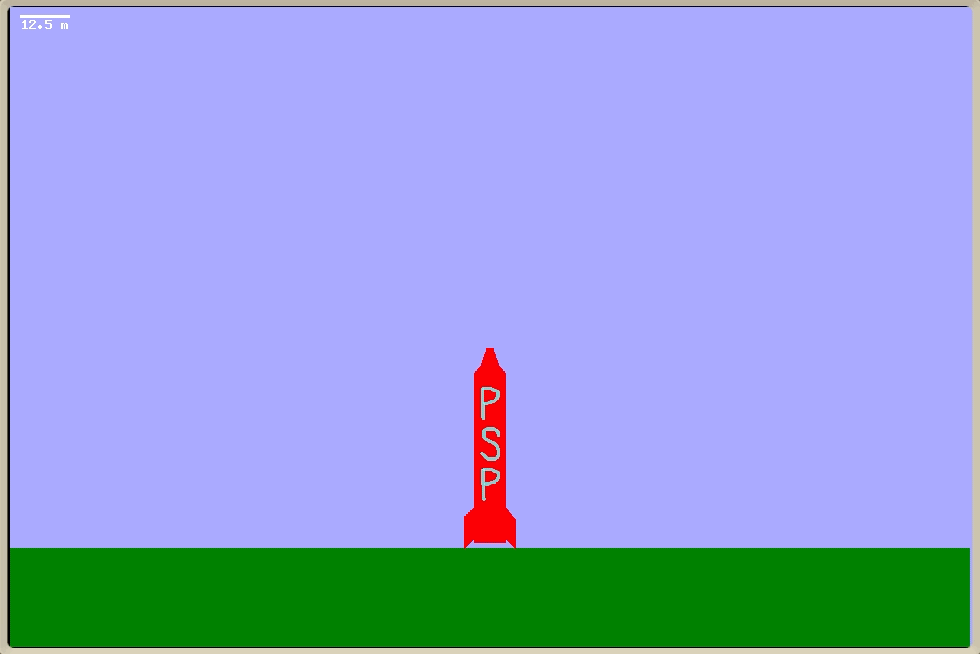

# pixelspaceprogram-prototype
Prototype of a 2D "pixel space program" game.  This prototype focuses on the tricky rendering issue: zooming all the way from ground level (where your rocket, and maybe even its occupants, are clearly visible) out to deep space, where the plane itself is just a small dot.

